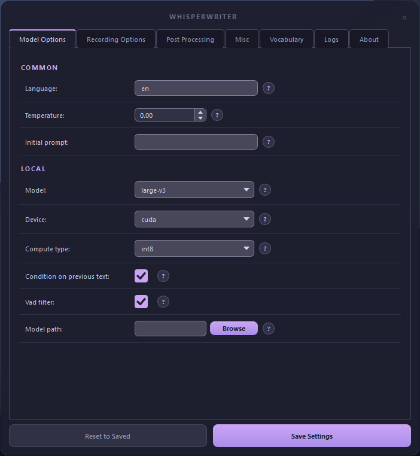

# WhisperWriter

> A fork of [savbell/whisper-writer](https://github.com/savbell/whisper-writer), rewritten by **noxie** and **Claude Sonnet 4.6**.

Local, offline speech-to-text that types for you. Press a hotkey → speak → the transcription is typed into whatever window is active. No cloud, no API key required.

<p align="center">
  
</p>

---

## What's different in this fork

The core transcription engine is unchanged. Everything around it was rewritten:

- **Catppuccin Mocha theme** — full dark UI across every widget, scroll bar, dialog, and tab
- **Microphone dropdown** — shows only real WASAPI input devices (no MME/DirectSound duplicates), just like the Windows Sound Control Panel
- **Human-readable settings** — recording modes show "Hold to Record" not `hold_to_record`; all setting labels and descriptions rewritten in plain English
- **Rich help dialogs** — every `?` button shows a one-line TLDR on hover and a detailed HTML popup on click
- **Vocabulary tab** — improved layout, larger font, clearer instructions
- **Logs tab** — real-time view of all app messages (captures logs even when "Print to Terminal" is off)
- **About tab** — project info and credits

<p align="center">
  
</p>

---

## Requirements

- **Python 3.11** — [python.org/downloads](https://www.python.org/downloads/)
- **Git** — [git-scm.com/downloads](https://git-scm.com/downloads)
- **Windows** (this fork targets Windows; the original supports Linux/macOS too)

**For GPU acceleration (optional but recommended):**

You need an NVIDIA GPU with CUDA 12. Install:
- [cuBLAS for CUDA 12](https://developer.nvidia.com/cublas)
- [cuDNN 8 for CUDA 12](https://developer.nvidia.com/cudnn)

Or grab the prebuilt libraries from [Purfview's whisper-standalone-win](https://github.com/Purfview/whisper-standalone-win/releases/tag/libs) — extract and add to `PATH`.

Without a GPU the app falls back to CPU automatically (slower, but works).

---

## Installation

### 1. Clone this repo

```bash
git clone https://github.com/Noxie0/whisper-writer
cd whisper-writer
```

### 2. Create and activate a virtual environment

```bash
python -m venv venv
venv\Scripts\activate
```

### 3. Install dependencies

```bash
pip install -r requirements.txt
```

### 4. Run

```bash
python src/run.py
```

On first launch the Settings window opens. Configure your preferences, hit **Save Settings**, then press **Start** in the main window. The default activation hotkey is `Ctrl+Shift+Space`.

---

## Settings reference

Open the Settings window at any time while the app is running.

### Model Options

| Setting | What it does | Default |
|---|---|---|
| Language | ISO-639-1 code (e.g. `en`, `fr`). Blank = auto-detect | *(blank)* |
| Temperature | Output randomness 0.0–1.0. 0.0 = most deterministic | `0.0` |
| Initial prompt | Text to prime the model before transcribing | *(blank)* |
| Model | Whisper model size (`tiny` → `large-v3`) | `medium` |
| Device | `auto` / `cuda` / `cpu` | `auto` |
| Compute type | Precision: `int8` fastest, `float32` most compatible | `default` |
| Condition on previous text | Use last transcription as context for the next | `true` |
| VAD filter | Strip silence before transcribing | `false` |
| Model path | Local model folder path. Blank = auto-download | *(blank)* |

### Recording Options

| Setting | What it does | Default |
|---|---|---|
| Activation key | Hotkey that triggers recording | `ctrl+shift+space` |
| Input backend | Key detection library: `auto` / `pynput` / `evdev` | `auto` |
| Recording mode | See modes below | `Continuous` |
| Sound device | Microphone to use (dropdown, WASAPI devices only) | System default |
| Sample rate | Hz. Whisper expects 16000 | `16000` |
| Silence duration | ms of silence before auto-stop | `900` |
| Min duration | Recordings shorter than this are discarded (ms) | `100` |

**Recording modes:**
- **Continuous** — keeps restarting after speech pauses until you press the key again
- **Voice Activity Detection** — stops automatically after silence; press again to start
- **Press to Toggle** — press to start, press again to stop
- **Hold to Record** — hold key to record, release to transcribe

### Post-processing Options

| Setting | What it does | Default |
|---|---|---|
| Writing key press delay | Seconds between simulated keystrokes | `0.005` |
| Remove trailing period | Strip the period Whisper appends | `false` |
| Add trailing space | Add a space after the transcription | `true` |
| Remove capitalization | Convert output to lowercase | `false` |
| Input method | Keystroke simulation library: `pynput` / `ydotool` / `dotool` | `pynput` |

### Miscellaneous

| Setting | What it does | Default |
|---|---|---|
| Print to terminal | Log status messages to the console | `true` |
| Hide status window | Hide the floating recording indicator | `false` |
| Noise on completion | Play a sound when transcription finishes typing | `false` |

### Vocabulary

Map words or phrases Whisper consistently gets wrong to their correct form. Matching is case-insensitive and applied before the text is typed out.

Example: `gonna` → `going to`

---

## Logs tab

Open Settings → **Logs** to see a live view of everything the app prints. Logs appear here regardless of the "Print to Terminal" setting. Use the **Clear** button to reset.

---

## Known issues

- Linux and macOS are untested in this fork. Use the [original repo](https://github.com/savbell/whisper-writer) for those platforms.
- The WASAPI device filter only works on Windows. On other OSes the dropdown would fall back to showing all devices.

---

## Roadmap

- [ ] **Standalone executable** — single `.exe` via PyInstaller, no Python install required
- [ ] **Installer** — one-click setup via Inno Setup or NSIS with Start Menu / desktop shortcuts
- [ ] **FunASR backend** — add [FunASR](https://github.com/modelscope/FunASR) as an alternative recognition engine (stronger on Chinese and multilingual audio)
- [ ] **Vosk backend** — lightweight offline option for low-end hardware
- [x] **System tray** — minimize to tray instead of taskbar, with right-click menu
- [ ] **Per-app profiles** — different hotkeys or post-processing rules per active window
- [ ] **Auto-update** — check GitHub releases for newer version on startup

---

## Credits

- **[savbell](https://github.com/savbell)** — original WhisperWriter project
- **[SYSTRAN / Guillaume Klein](https://github.com/SYSTRAN/faster-whisper)** — faster-whisper transcription engine
- **[OpenAI](https://openai.com/)** — Whisper model
- **noxie** and **Claude Sonnet 4.6** — this rewrite

## License

GNU General Public License v3. See [LICENSE](LICENSE).
